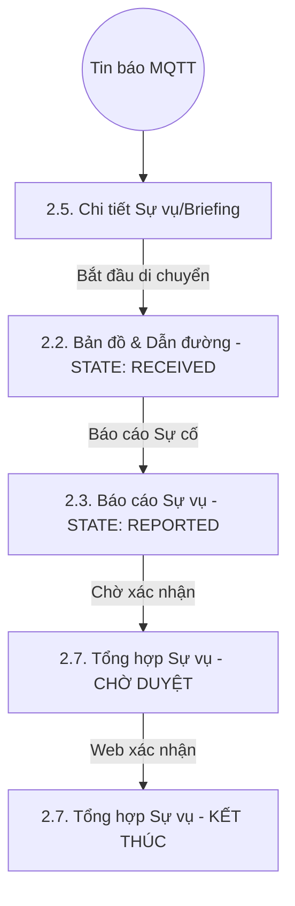
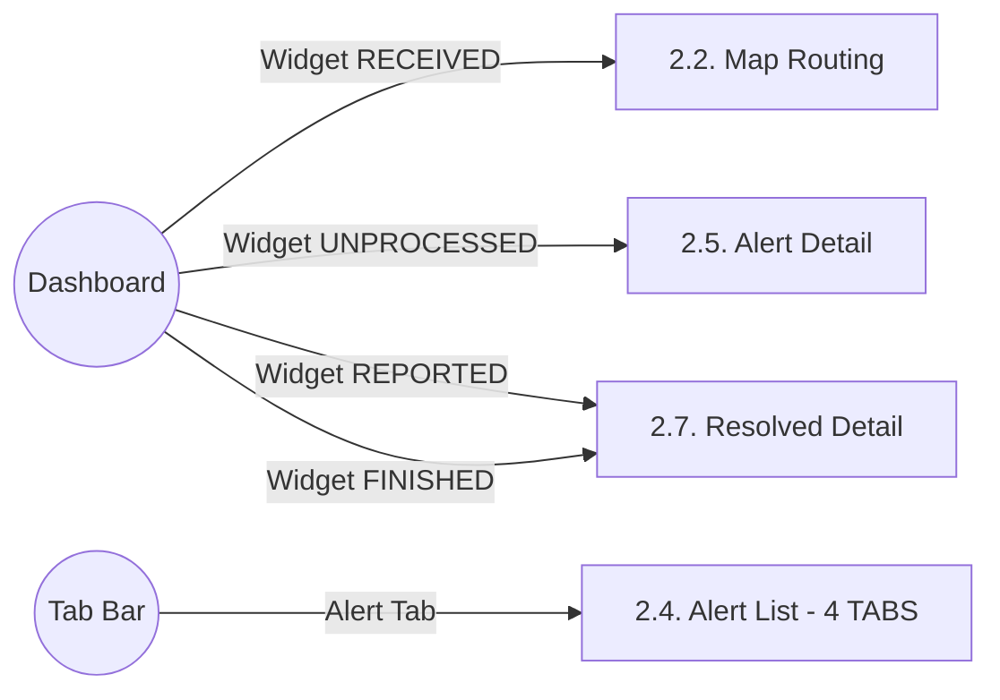
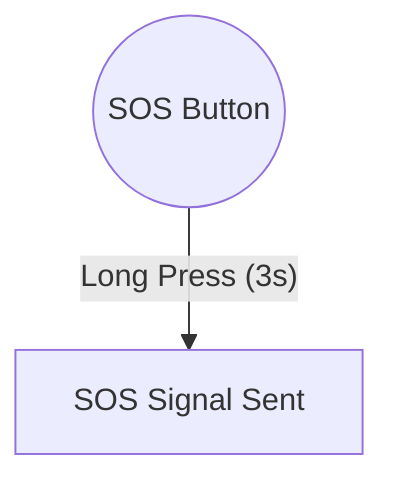
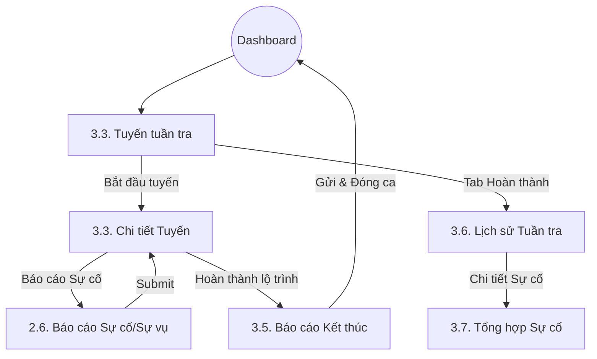

# Danh mục Đặc tả Giao diện (UI Specification) - ANVL Mobile

Tài liệu này quản lý toàn bộ các đặc tả về giao diện (UI) và trải nghiệm người dùng (UX) cho ứng dụng ANVL, đảm bảo tính đồng nhất về thẩm mỹ và trải nghiệm trên toàn hệ thống.

> [!IMPORTANT]
> **Toàn bộ ứng dụng hỗ trợ Adaptive Theme (Sáng/Tối) và được bản địa hóa 100% sang tiếng Việt.** Các thành phần UI trong đặc tả này phải luôn tuân thủ nguyên tắc "Dynamic Color" từ Design System.

## 🎨 Nền tảng Thiết kế (Global Design)
- **[Hệ thống Thiết kế (Design System)](./ui.design-system.md)**: Màu sắc, Typography, Spacing, Global Components, Popup Quy chuẩn.

## 🔄 Sơ đồ Luồng người dùng (User Flows)

### 🚨 Luồng Xử lý Cảnh báo Khẩn cấp (4 Giai đoạn)

### 👤 Luồng Điều hướng từ Dashboard

*Lưu ý: Các luồng nâng cao như Đăng nhập Offline, Sinh trắc học và Quản lý Ticket đã được chuyển sang giai đoạn sau.*

### 🚨 Luồng SOS Toàn cục

### 🛠️ Luồng Tuần tra MVP

## 📱 Đặc tả Giao diện theo Màn hình (Screen UI Specs)

### Module 1: Xác thực & Nền tảng
- [UI 1.1: Màn hình Dashboard (Trang chủ)](./ui.1.1.dashboard.md)
- [UI 1.2: Màn hình Đăng nhập (Online MVP)](./ui.1.2.login.md)
- [UI 1.3: Màn hình Hồ sơ & Thiết bị](./ui.1.3.profile.md)

### Module 2: Hệ thống Cảnh báo & Bản đồ
- [UI 2.2: Màn hình Bản đồ & Dẫn đường](./ui.2.2.map-routing.md)
- [UI 2.3: Màn hình Báo cáo Sự vụ/Sự cố (Dynamic)](./ui.2.3.incident-report.md)
- [UI 2.4: Màn hình Danh sách Cảnh báo (Main Tab)](./ui.2.4.alert-list.md)
- [UI 2.5: Màn hình Chi tiết Cảnh báo (Briefing)](./ui.2.5.alert-detail.md)
- [UI 2.6: Màn hình Báo cáo Sự cố/Sự vụ (Tuần tra)](./ui.2.6.occurrence-report.md)
- [UI 2.7: Màn hình Tổng hợp Sự vụ (Resolved Detail)](./ui.2.7.alert-resolved-detail.md)

### Module 3: Vận hành & Hậu cần (MVP)
- [UI 3.3: Màn hình Tuyến tuần tra (Danh sách/Chi tiết)](./ui.3.3.patrol-route.md)
- [UI 3.5: Màn hình Báo cáo Kết thúc Ca](./ui.3.5.patrol-report.md)
- [UI 3.6: Màn hình Tóm tắt Lịch sử Tuần tra](./ui.3.6.patrol-history.md)
- [UI 3.7: Màn hình Tổng hợp Sự cố Tuần tra](./ui.3.7.patrol-incidents-summary.md)

### 📁 Các tính năng trì hoãn (Future Scope)
> [!NOTE]
> Toàn bộ đặc tả cho các tính năng: **Offline Mode, Bảo trì Ticket, Check-in NFC, Biometrics** đã được di chuyển sang tài liệu riêng biệt để tập trung vào MVP.
> 
> Xem thêm: **[ANVL Future Scope (Docs)](../docs/future-scope.md)**

---
*Lưu ý: Mọi quyết định quan trọng (Create, Update, Delete, Submit) đều phải hiển thị Popup Xác nhận theo chuẩn Design System.*
