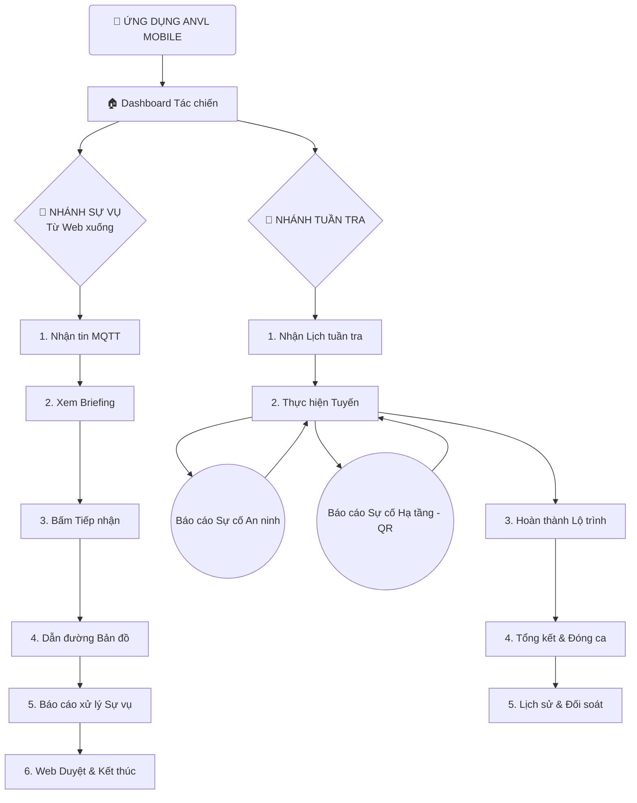

# Product Brief: ANVL Mobile - Giải pháp An ninh Tác chiến

## 1. Tổng quan Sản phẩm
ANVL Mobile là ứng dụng di động dành cho nhân viên an ninh hiện trường, đóng vai trò là một "Trung tâm chỉ huy di động" (Mobile Command Center). Ứng dụng giúp tiếp nhận, xử lý Sự vụ khẩn cấp và thực hiện các nhiệm vụ tuần tra một cách chuyên nghiệp, nhanh chóng và chính xác.

## 2. Các Tính năng Cốt lõi (Hiện hữu)

### 📊 Dashboard & Quản lý Tác chiến
- **Bộ 4 Widget Trạng thái**: Theo dõi thời gian thực số lượng cảnh báo theo 4 trạng thái: *Chờ tiếp nhận*, *Đã tiếp nhận*, *Đã báo cáo*, *Kết thúc*.
- **Active Mission Banner**: Hiển thị các nhiệm vụ đang thực hiện (RECEIVED) kèm bộ đếm thời gian (Timer) cập nhật từng giây.
- **Patrol Hero Widget**:
    - **Ưu tiên 3:** Chỉ hiển thị lịch ngày mai khi hôm nay không còn lịch trình nào cần xử lý (Trống hoặc đã Hoàn thành).
    - **Ẩn:** Các ca đã Hoàn thành trong ngày hôm nay sẽ không xuất hiện trên Dashboard.
    - **Định danh:** Không hiển thị mã ID (R-XXX) trên các thẻ tại Dashboard.

### 🚨 Hệ thống Cảnh báo & Xử lý (Alerts Lifecycle)
- **Vòng đời 4 trạng thái**: Chuẩn hóa quy trình từ lúc tin mới đến (Chờ tiếp nhận) -> Tiếp nhận (RECEIVED) -> Báo cáo (REPORTED) -> Kết thúc (FINISHED).
- **Tab Cảnh báo**: Giao diện tập trung để quản lý và lọc các sự vụ theo trạng thái.

### 🗺️ Bản đồ & Dẫn đường (Map & Routing)
- **Hỗ trợ Đa tầng (Indoor/Outdoor)**: Hiển thị Floor Badge (Số tầng) Neon Red để định vị chính xác trong tòa nhà.
- **Layer Management**: Quản lý hiển thị các lớp thông tin: Camera, Thiết bị IoT, Tòa nhà, Khu vực.
- **Dẫn đường kỹ thuật**: Vẽ lộ trình từ vị trí hiện tại đến vị trí Sự vụ.

### 🛡️ Tuần tra & Phản ứng hiện trường (Patrol & Reporting)
- **Lịch trình Đa ngày (Multi-day)**: Thanh Date Strip giúp duyệt kế hoạch công tác theo tuần.
- **Quản lý Trạng thái đa sắc**: Phân loại trực quan (Cam, Xanh dương, Xanh lá) kèm bộ đếm số lượng thực tế.
- **Start Behavior Tracking**: Nút "BẮT ĐẦU" giúp ghi nhận thời điểm thực thi và cảnh báo "Bắt đầu muộn" tự động.
- **Báo cáo & Lịch sử**:
    - Màn hình **Tóm tắt Lịch sử**: Xem lại kết quả, quãng đường và xác nhận GPS của các ca đã xong.
    - **Tổng hợp Sự cố**: Quản lý danh sách các bất thường đã ghi nhận trong từng ca trực.
- **Phản ứng linh hoạt**: Cho phép báo cáo sự cố phát sinh ngay trong khi đang xem lộ trình tuần tra.
- **Navigation Payload:**
    - `patrol.tsx` -> `patrol-details.tsx`: `{ routeId, routeName }`.
    - `patrol.tsx` -> `patrol-report.tsx`: `{ routeId, routeName }` (Hỗ trợ cả Hoàn thành & Đã báo cáo).
    - `patrol-report.tsx` -> `patrol-incidents-summary.tsx`: `{ routeName }`.
    - `patrol-details.tsx` -> `patrol-report.tsx`: `{ routeId, distance, updates, incidents, duration }`.
- Báo cáo hư hỏng thiết bị (QR Code support) cho hạ tầng kỹ thuật.
- Đồng bộ 100% Online với trung tâm chỉ huy (TTCH).

### 🆘 SOS & An toàn (Security Features)
- **Global SOS**: Nút nhấn giữ 3 giây để gửi tín hiệu khẩn cấp toàn cục.
- **Hotline Chỉ huy**: Truy cập nhanh để gọi điện trực tiếp về trung tâm.

## 3. Hệ thống Thiết kế (Design System)
- **Ngôn ngữ**: Tactical Dark Mode (Deep Black & Neon Accents).
- **Màu sắc Tác chiến**: 
  - Red (#FF3B30): Khẩn cấp.
  - Orange (#FF9500): Chú ý.
  - Cyan (#00F2FF): Dẫn đường.
  - Green (#34C759): An toàn/Hoàn thành.
- **Trải nghiệm (UX)**: 
  - Phản hồi xúc giác (Haptics) & hiệu ứng Pulse.
  - Tự động chuyển tab (Auto-switch) khi bắt đầu nhiệm vụ.
  - Unified Briefing Card cho trải nghiệm tác chiến tập trung.

## 4. Sơ đồ Luồng Nghiệp vụ (Flowchart)

## 5. Luồng Người dùng Trọng tâm
1.  **Xử lý Sự vụ**: Dashboard -> Nhận tin báo -> Bản đồ dẫn đường đến Sự vụ -> Hiện trường -> Báo cáo xử lý Sự vụ -> Hoàn tất.
2.  **Tuần tra**: Dashboard -> Chi tiết Tuyến -> Theo dõi lộ trình trên bản đồ -> Báo cáo Sự cố (nếu có) -> Kết thúc ca & Tổng kết.

## 5. Trạng thái Hiện tại (MVP Status)
- Toàn bộ nội dung tập trung vào chế độ **Online**.
- Các tính năng nâng cao (Offline, Quản lý Ticket, Check-in NFC, Biometrics) được chuyển sang tài liệu dự phòng.
- Xem chi tiết tại: **[Future Scope](./future-scope.md)**
