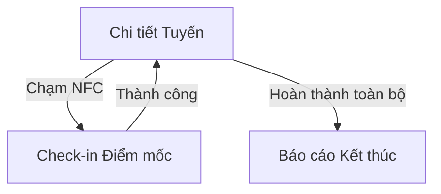

# Future Scope: Các tính năng trì hoãn (Post-MVP)

Tài liệu này lưu trữ các đặc tả kỹ thuật và yêu cầu cho các tính năng không nằm trong phạm vi MVP (Phiên bản đầu tiên) của ANVL Mobile. Các tính năng này sẽ được xem xét và triển khai trong các giai đoạn (phase) tiếp theo.

## 1. EPIC: Vận hành & Bảo trì (Maintenance & Operations)
Tập trung vào đội ngũ kỹ thuật và quản lý thiết bị.

- **[UI 3.1: Danh sách Ticket](../UI-specs/deferred/ui.3.1.ticket-list.md)**: Quản lý danh sách các yêu cầu sửa chữa, bảo trì thiết bị an ninh. (*Hiện chưa có file chi tiết*)
- **[UI 3.2: Chi tiết Ticket](../UI-specs/deferred/ui.3.2.ticket-detail.md)**: Luồng xử lý kỹ thuật, ghi chú phụ tùng và xác nhận hoàn thành.

## 2. EPIC: Tuần tra Nâng cao (Advanced Patrol)
Bổ sung các cơ chế giám sát vật lý nghiêm ngặt.

- **[UI 3.4: Check-in NFC/Checkpoint](../UI-specs/deferred/ui.3.4.checkpoint-checkin.md)**: Yêu cầu nhân viên phải chạm điện thoại vào thẻ NFC tại các điểm mốc mới được phép tiếp tục lộ trình.
- **Luồng tuần tra có điểm mốc**:

## 3. EPIC: Tính năng Hệ thống Nâng cao (Advanced Core)
Tăng cường bảo mật, khả năng hoạt động linh hoạt và kết nối thực tế.

- **Kết nối Real-time (MQTT)**: Chuyển đổi từ cơ chế giả lập sang kết nối Socket/MQTT thực tế để nhận tin báo tức thời từ server.
- **Background GPS Tracking (Heartbeat)**: Tự động ghi nhận tọa độ nhân viên mỗi 5-10 giây ngay cả khi ứng dụng đang chạy nền hoặc khóa màn hình. 
- **Quét mã QR (Hardware Integration)**: Sử dụng camera vật lý để quét mã định danh thiết bị/hạ tầng khi thực hiện báo cáo bảo trì.
- **Chế độ Offline hoàn toàn**: 
  - Đăng nhập Offline (phiên 24h).
  - Badge trạng thái đồng bộ và cảnh báo hết hạn phiên.
  - Cơ chế Sync dữ liệu khi có mạng trở lại.
- **Xác thực Sinh trắc học**: Hỗ trợ FaceID và Vân tay để tăng tốc độ truy cập.
- **[UI 2.1: Overlay Khẩn cấp](../UI-specs/deferred/ui.2.1.alert-overlay.md)**: Màn hình chiếm quyền ưu tiên cực cao (Heartbeat Pulse) khi cập nhật Sự vụ quan trọng. (*Tạm thời ẩn theo yêu cầu*)

---
*Cập nhật ngày: 26/01/2026*
