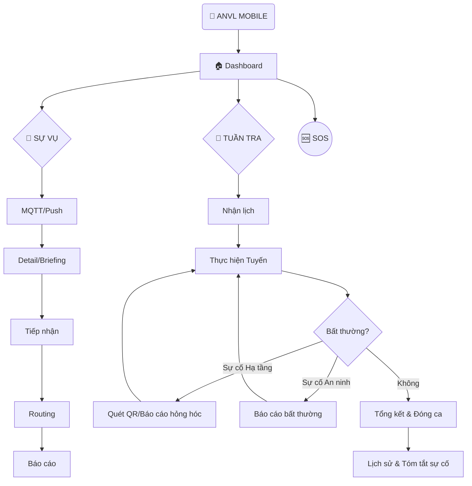

# Product Requirement Document (PRD): ANVL Mobile

## 1. Giới thiệu
Ứng dụng ANVL Mobile là công cụ tác chiến hiện trường dành cho nhân viên an ninh, giúp tối ưu hóa việc tiếp nhận thông tin, dẫn đường đến Sự vụ và báo cáo kết quả (Sự vụ) hoặc báo cáo phát sinh (Sự cố) trong các khu vực quản lý phức tạp (đa tòa nhà, đa tầng).

## 2. Mục tiêu Sản phẩm (Product Goals)
- **Tốc độ**: Giảm thời gian phản ứng từ khi nhận cảnh báo đến khi có mặt tại hiện trường.
- **Chính xác**: Cung cấp thông tin vị trí tầng, tòa nhà và lộ trình dẫn đường rõ ràng.
- **Minh bạch**: Quy chuẩn hóa quy trình báo cáo hiện trường bằng hình ảnh và dữ liệu số.
- **Duy trì hạ tầng**: Phát hiện và báo cáo kịp thời các hư hỏng thiết bị/hạ tầng (Camera, PCCC, Khóa) để đảm bảo tính sẵn sàng của hệ thống an ninh.

## 3. Cấu trúc Chức năng theo EPIC (Functional Structure)

### EPIC 1: Quản lý Truy cập & Nền tảng (Access & Platform)
- **Story 1.1: Đăng nhập**: Xác thực mã NV/SĐT.
- **Story 1.2: Bảo mật Phiên**: Duy trì đăng nhập & Đăng xuất an toàn.
- **Story 1.3: Dashboard ID & Counter**: Hiển thị hồ sơ & widget trạng thái.
- **Story 1.4: Dashboard Mini-Map**: Bản đồ nhỏ định vị nhân viên.
- **Story 1.5: Dashboard Patrol Hero**: Hiển thị ưu tiên thẻ ca tuần tra thông minh. Chỉ hiện lịch ngày mai khi hôm nay đã hoàn thành hoặc không có lịch. Ẩn các ca đã hoàn thành để tối ưu không gian tác chiến.
- **Story 1.6: Active Mission Banner**: HUD đỏ cố định hiển thị nhiệm vụ RECEIVED.
- **Story 1.7: Thay đổi Mật khẩu**: Tự quản lý bảo mật cá nhân.
- **Story 1.8: Tùy chỉnh Theme**: Chuyển đổi Sáng/Tối/Hệ thống.
- **Story 1.9: Chính sách Bảo mật**: Tra cứu điều khoản sử dụng & bảo vệ dữ liệu.

### EPIC 2: Hệ thống Cảnh báo & Công việc (Incident Management)
- **Story 2.1: Alert List UI**: Phân loại 5 trạng thái (bao gồm tab TẤT CẢ để đối soát) & tab bộ lọc.
- **Story 2.2: MQTT Real-time**: Đồng bộ dữ liệu sự vụ tức thời.
- **Story 2.3: Tactical Mission UI**: Giao diện tác chiến tích hợp Bản đồ, Unified Briefing Card và Media.
- **Story 2.4: Phản ứng Sự vụ & Lifecycle**: Quy trình Tiếp nhận, Xử lý và Báo cáo kết quả.

### EPIC 3: Bản đồ & Dẫn đường (Tactical Map & Navigation)
- **Story 3.1: Tactical Map & Layers**: Bật/tắt các lớp Camera, IoT, Tòa nhà.
- **Story 3.2: Dẫn đường Ngoài trời**: Chỉ dẫn lộ trình dựa trên GPS.
- **Story 3.3: Dẫn đường Trong nhà**: Chỉ dẫn logic (Tầng/Phòng) theo bối cảnh.

### EPIC 4: Hệ thống Thông báo & Cảnh báo (Notification System)
- **Story 4.1: Push Notification**: Thông báo hệ thống khi có sự vụ mới (Foreground/Background).
- **Story 4.2: Critical Alert Overlay (Ringing)**: Giao diện tràn màn hình, rung và âm báo mạnh cho sự vụ khẩn cấp.
- **Story 4.3: Sound & Haptic Profiles**: Phân biệt âm báo theo mức độ ưu tiên (Critical vs Normal).
- **Story 4.4: Deep Linking**: Chạm vào thông báo để mở trực tiếp màn hình Tiếp nhận sự vụ (Briefing).

### EPIC 5: Tuần tra & Nhật ký di chuyển (Patrol & Monitoring)
- **Story 5.1: GPS Tracking**: Ghi nhật ký tọa độ tự động (Heartbeat).
- **Story 5.2: Lịch trình Đa ngày (Multi-day)**: Quản lý công việc theo dòng thời gian. Hỗ trợ 4 trạng thái: Chưa thực hiện, Đang thực hiện, Hoàn thành, Đã báo cáo.
- **Story 5.3: Báo cáo Sự cố Phát sinh**: Chụp ảnh & GPS sự cố tự phát sinh.
- **Story 5.4: Tổng kết & Lịch sử (Unified Flow)**: Thống kê ca trực, hỗ trợ nhập ghi chú động, xem nhật ký GPS và tóm tắt sự cố. Tự động chuyển đổi giữa chế độ Báo cáo (Cần chữ ký) và Lịch sử (Read-only) dựa trên trạng thái.
- **Story 5.5: Tổng hợp Sự cố theo Ca**: Xem danh sách chi tiết các sự cố đã báo cáo trong một ca tuần tra cụ thể.
- **Story 5.6: Ghi nhận Bắt đầu (Start Behavior)**: Track hành vi bắt đầu thực tế so với lịch trình.
- **Story 5.7: Nhật ký vị trí & Tín hiệu GPS**: Tra cứu chi tiết từng điểm di chuyển và độ chính xác tín hiệu.

### PHÁT TRIỂN TRONG TƯƠNG LAI (PHASE 2+)
- **Story 6.1: SOS Toàn cục (Global Panic)**: Nút nổi báo động khẩn cấp (3s press) gửi tín hiệu kèm vị trí GPS và kích hoạt chế độ Emergency toàn hệ thống.
- **Story 6.2: Báo cáo Sự cố Thiết bị/Hạ tầng**: Quy trình quét mã QR, chụp ảnh và phân loại hư hỏng thiết bị kỹ thuật để chuyển tiếp đội bảo trì.
- **Story 6.3: Quản lý Bảo trì (Tickets)**: Tiếp nhận, lộ trình dẫn đường và xử lý các phiếu công việc kỹ thuật dành cho lực lượng phản ứng nhanh (First Responder).

## 4. Yêu cầu Phi chức năng (Non-functional Requirements)

### 4.1. Trải nghiệm Người dùng (UX/UI)
- **Thẩm mỹ**: Tactical Dark Mode.
- **Phản hồi**: Haptic Feedback cho hành động trọng tâm.
- **Ngôn ngữ**: 100% tiếng Việt.

### 4.2. Hiệu năng & Bảo mật
- **Thời gian thực**: MQTT Latency < 2s.
- **Độ tin cậy**: GPS Tracking hoạt động ổn định ở chế độ Foreground.

## 5. Phạm vi Sản phẩm (Scope)
- **Trong phạm vi (Phase 1)**: Dashboard, Cảnh báo, Hệ thống Thông báo (In-app/Ringing), Bản đồ tác chiến, Dẫn đường logic, Tuần tra (4 trạng thái), Lịch sử tóm tắt sự vụ, Nhật ký vị trí GPS.
- **Ngoài phạm vi / Phase sau (Deferred)**: Chế độ Offline hoàn toàn, SOS Toàn cục, Thông báo đẩy (Push/Killed State), Báo cáo sự cố thiết bị/hạ tầng, Quản lý Bảo trì.
- **Quy chuẩn Định danh**: Mã ID Kế hoạch (Plan ID) được lược bỏ khỏi các màn hình tác chiến (Dashboard, Danh sách, Chi tiết) để tinh giản giao diện, nhưng được giữ lại trong các báo cáo (Báo cáo sự cố, Báo cáo tuần tra, Lịch sử) để phục vụ đối soát.

## 6. Sơ đồ Luồng Nghiệp vụ (Business Workflow)

---
*Cập nhật: 04/02/2026*
