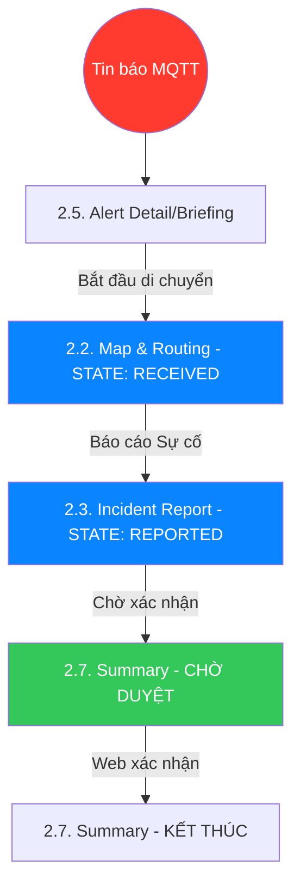
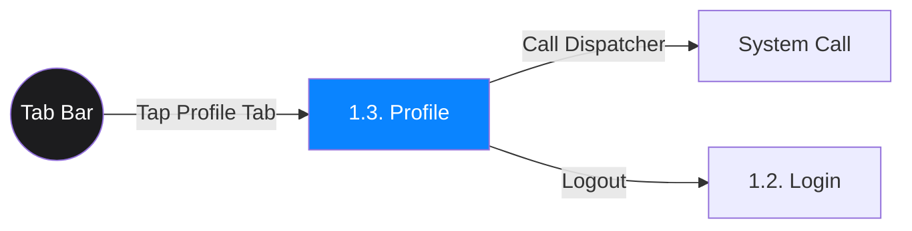
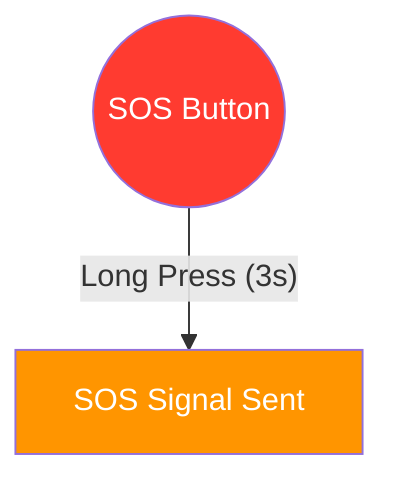
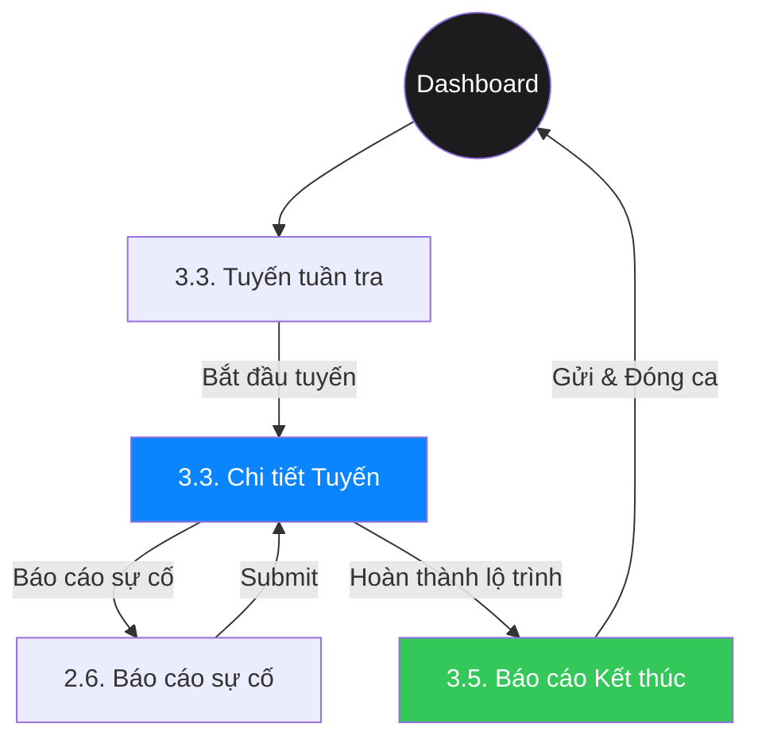
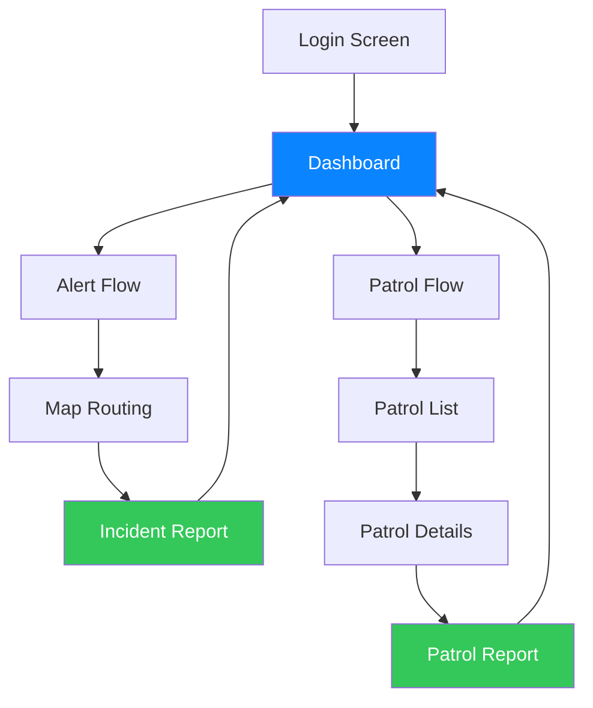

# 📱 TỔNG HỢP ĐẶC TẢ GIAO DIỆN - ANVL MOBILE

> **Tài liệu tổng hợp**: Phân tích chi tiết 11 tài liệu UI Specification  
> **Ngày tạo**: 2026-01-15  
> **Nguồn**: [d:\ANVL Mobile\anvlmb\UI-specs](file:///d:/ANVL%20Mobile/anvlmb/UI-specs)

---

## 🎯 Tổng quan Hệ thống

**ANVL Mobile** là ứng dụng di động chuyên nghiệp dành cho **nhân viên an ninh** để:
- ⚡ Xử lý cảnh báo khẩn cấp theo thời gian thực
- 🗺️ Điều hướng và định vị hiện trường
- 🚶 Quản lý lộ trình tuần tra tác chiến

**Triết lý thiết kế**: **"Security First"** - Tối giản, tập trung, hiệu quả cao trong môi trường khẩn cấp.

---

## 🎨 Hệ thống Thiết kế (Design System)

### Nguyên lý Cốt lõi

| Nguyên lý | Mô tả |
|:----------|:------|
| **Security First** | Giao diện tối giản, tập trung vào thông tin quan trọng nhất để đưa ra quyết định nhanh |
| **Tactical Dark Mode** | Nền tối sâu (#000000) giảm mỏi mắt và tiết kiệm pin cho thiết bị di động |
| **High Contrast** | Các thành phần cảnh báo có độ tương phản cực cao (Neon colors trên nền tối) |

### Bảng Màu Chính

#### 🎨 Màu Chức năng

| Loại | Màu | Hex | Công dụng |
|:-----|:----|:----|:----------|
| **Danger** | 🔴 Neon Red | `#FF3B30` | Trạng thái **ĐÃ TIẾP NHẬN**, Báo cháy, SOS |
| **Warning** | 🟡 Alert Orange | `#FF9500` | Trạng thái **CHƯA XỬ LÝ**, Chú ý |
| **Primary** | 🔵 Security Blue | `#0A84FF` | Trạng thái **ĐÃ BÁO CÁO** (Chờ duyệt), Dẫn đường |
| **Safe** | 🟢 Tactical Green | `#34C759` | Trạng thái **KẾT THÚC**, Thành công |

#### 🌑 Màu Nền & Trung tính

| Loại | Màu | Hex | Công dụng |
|:-----|:----|:----|:----------|
| **Base** | Deep Black | `#000000` | Nền chính của toàn app |
| **Surface** | Dark Grey | `#1C1C1E` | Card, Bottom Sheet, Input Background |
| **Text** | Pure White | `#FFFFFF` | Nội dung chính |
| **Muted** | Silver | `#8E8E93` | Label, thông tin phụ |

### Typography

**Font chính**: **Inter** (fallback: Roboto)

| Cấp độ | Kích thước | Font Weight | Công dụng |
|:-------|:-----------|:------------|:----------|
| **Header 1** | 24px | Bold | Tiêu đề màn hình |
| **Header 2** | 20px | Semi-bold | Tiêu đề module |
| **Body** | 16px | Regular | Nội dung chính |
| **Caption** | 12px | Regular | Thông tin phụ, timestamp |

### Thành phần Toàn cục

#### 🔘 Buttons

| Loại | Đặc điểm | Công dụng |
|:-----|:---------|:----------|
| **Primary Button** | Nền `#0A84FF`, chữ trắng, bo góc 12px | Action chính |
| **Danger Button** | Nền `#FF3B30`, bo góc 12px, có hiệu ứng Pulse | Hành động nguy hiểm |
| **Success Button** | Nền `#34C759` | Hoàn thành/Xác nhận |
| **Ghost/Secondary** | Nền `#38383A` hoặc trong suốt | Hủy/Bỏ qua |
| **Global SOS FAB** | Nút tròn nổi màu Đỏ Neon, giữa Bottom Bar | **Luôn hiển thị mọi màn hình** |

#### 🏷️ Cards

- Bo góc: **16px**
- Background: `#1C1C1E` với viền mờ (Border 0.5px, `#38383A`)
- Hiệu ứng: Subtle Outer Glow cho sự cố khẩn cấp

#### ⚠️ Popup Xác nhận

> [!IMPORTANT]
> Mọi hành động **Create, Update, Delete, Submit** đều PHẢI hiển thị Popup Xác nhận.

**Cấu trúc**:
- Layout: Trung tâm màn hình, lớp phủ mờ (Scrim) 70% đen
- Tiêu đề (Bold): Thông báo ngắn gọn
- Nội dung (Regular): Giải thích hệ quả
- Buttons: Xác nhận (bên phải, màu tương ứng) + Hủy (bên trái, Neutral)

### Animation Guidelines

- **Alert Pulse**: Icon cảnh báo có hiệu ứng nhịp thở (Scale 1.0 → 1.1) liên tục
- **Micro-interactions**: Phản hồi xúc giác (Haptic feedback) khi nhấn nút hoặc quét thành công

---

## 🔄 Sơ đồ Luồng Người dùng

### 🚨 Luồng Xử lý Cảnh báo Khẩn cấp (4 Giai đoạn)



### 👤 Luồng Tài khoản & Cài đặt



### 🚨 Luồng SOS Toàn cục



### 🛠️ Luồng Tuần tra MVP



---

## 📱 Chi tiết Đặc tả Màn hình

### Module 1: Xác thực & Nền tảng

#### [UI 1.2: Màn hình Đăng nhập](file:///d:/ANVL%20Mobile/anvlmb/UI-specs/ui.1.2.login.md)

**Visual Style**:
- Theme: Dark Mode chuyên nghiệp
- Background: Gradient chìm (Deep Blue to Black)
- Logo ANVL: Hiển thị chính tâm

**Luồng nghiệp vụ**:
- **Entry**: App đã kiểm tra Device Binding thành công
- **Exit**: Dashboard (Home)

**2 Chế độ hoạt động**:

##### 🌐 Chế độ Online
- Form đăng nhập với **Floating Label**
- Input Tài khoản: Icon User, placeholder "Tên đăng nhập / Mã nhân viên"
- Input Mật khẩu: Icon Lock, icon Eye (toggle show/hide)
- Nút Login: Primary Blue, bo góc 12px, chữ IN HOA
- Nút Biometric: Text Link / Icon nhỏ

**Interaction & Animation**:
- Button Loading: Spinner quay đều khi nhấn "Đăng nhập"
- Error Feedback: Input rung nhẹ (Shake animation) + text đỏ

---

#### [UI 1.3: Màn hình Profile](file:///d:/ANVL%20Mobile/anvlmb/UI-specs/ui.1.3.profile.md)

**Vị trí**: Tab ngoài cùng bên phải Bottom Navigation Bar

**Tính năng chính**:
- 👤 Xem thông tin cá nhân
- 📱 Quản lý thiết bị (Binding)
- 📞 **Nút "GỌI CHỈ HUY"**: Hotline khẩn cấp (màu xanh lá)
- 🚪 Đăng xuất (nút đỏ)

**Layout**:
- Avatar Header: Ảnh & Info Text
- Call Dispatcher: Nút lớn, Icon Phone → Gọi nhanh về trung tâm
- Logout Button: Full-width, Outlined Red

---

---

#### [UI 2.2: Màn hình Bản đồ & Dẫn đường (v2.0)](file:///d:/ANVL%20Mobile/anvlmb/UI-specs/ui.2.2.map-routing.md)

**Visual Style**:
- Map Theme: **Dark-themed Mapbox** với đường giao thông tối, tòa nhà màu xám xanh
- Routing Line: Màu xanh Neon (#00F2FF) với mũi tên chạy dọc (Flowing arrows)

**Layer System** - 5 loại markers:

| Layer | Màu | Marker Type |
|:------|:----|:------------|
| 🔴 Cảnh báo/Sự vụ | Red | Circle markers |
| 🔵 Camera | Blue | Circle markers |
| 🟢 Thiết bị IoT | Green | Circle markers |
| 🏢 Tòa nhà | Overlay | Polygon overlays |
| 🗺️ Khu vực | Transparent | Color-coded areas |

**2 Chế độ hoạt động**:

##### 1️⃣ Idle Mode (Không có nhiệm vụ)

> [!NOTE]
> Navigation Card **KHÔNG** hiển thị trong chế độ này

- Bản đồ chiếm **100%** diện tích
- User Location: Blue dot với accuracy circle
  - Xanh: < 10m
  - Đỏ: > 10m
- Floating Controls:
  - Layers button (mở Layer Menu)
  - Zoom In/Out
  - Re-center (Locate)

##### 2️⃣ Navigation Mode (Có nhiệm vụ)

**Kích hoạt khi**: `incidentId` hoặc `destination` được truyền vào

- Routing Line: Polyline từ user location → destination
- **Navigation Panel** (Card dưới màn hình):
  - ETA và Khoảng cách
  - Next turn instruction
  - Nút **"TÔI ĐÃ ĐẾN"**
  - **Premium Floor Badge**: Hiển thị thông tin tầng hiện tại (G, 1, 2...) với hiệu ứng glassmorphism.

**Layer Management**:
- Bottom Sheet với 5 toggle switches
- Smooth fade in/out khi bật/tắt layers

**Interaction & Animation**:
- **Auto-Follow**: Bản đồ tự động xoay và di chuyển theo GPS
- **Marker Pulse**: Marker điểm đến có vòng tròn sóng lan tỏa
- **GPS Simulation**: Cập nhật mỗi 2 giây (mock)
- **Marker Click**: Click vào marker (Alert/Camera/IoT) → Kích hoạt Navigation Mode với routing đến marker đó
- **Re-center**: Nhấn nút Locate → Map quay về vị trí user

**Mock Data**:
- 2 Alerts
- 3 Cameras
- 2 IoT devices
- 3 Buildings
- 1 Zone

---

#### [UI 2.3: Màn hình Báo cáo Sự vụ](file:///d:/ANVL%20Mobile/anvlmb/UI-specs/ui.2.3.incident-report.md)

**Concept**: **"Clean & Accountability"** - Giao diện nhập liệu sạch sẽ, rõ ràng

**Luồng nghiệp vụ**:
- **Entry**: Nhấn nút báo cáo từ Map sau khi đến hiện trường
- **Quy trình**: Chụp ảnh → Chọn kết quả → Nhấn Gửi → **Popup Xác nhận** → Đồng bộ
- **Exit**: Dashboard (Home)

**Layout & Composition**:
- **Image Grid**: Thumbnail lưới 3 cột có đính kèm **nhãn tên tệp**.
- **Action Button**: Nút "Gửi báo cáo sự vụ" cố định ở dưới (Sticky Bottom), không có icon.

**Thành phần chi tiết**:

| ID | Thành phần | Mô tả Visual | Tính năng |
|:---|:-----------|:-------------|:----------|
| UI_REP_01 | Media Grid | Lưới thumbnail có nút Xóa | Xem trước Media |
| UI_REP_BTN_PHOTO | Photo Button | Icon Camera | Chụp ảnh |
| UI_REP_BTN_VIDEO | Video Button | Icon Video Camera | Quay video (Max 30s) |
| UI_REP_02_QS | Quick Select Chips | Pill badges màu Primary | Chọn nhanh (Append không trùng) |
| UI_REP_03 | Note Field | Multiline input, nền Surface thích ứng | Nhập giải trình |
| UI_REP_04 | Submit Button | Primary Blue, Full-width | Xác nhận gửi (Popup xác nhận) |
| UI_REP_05 | Cancel Button | Text Link "Hủy" hoặc Icon Back | Quay lại màn hình trước |

**Validation**:
- Nút Submit chỉ enabled khi: `image_count > 0` và `status != null`
- Offline Sync: Icon đám mây gạch chéo nếu lưu tạm vào local

---

---

#### [UI 3.3: Màn hình Tuyến tuần tra](file:///d:/ANVL%20Mobile/anvlmb/UI-specs/ui.3.3.patrol-route.md)

**Concept**: **"Bản đồ Nhiệm vụ Hiện đại"**

**Màu sắc nhấn**:
- Electric Blue (#0A84FF): Tiến độ
- Safe Green (#30D158): Hoàn thành

**2 View chính**:

##### 📋 Danh sách Tuyến tuần tra

**Cấu trúc Route Card**:
- Tiêu đề: Tên tuyến (Bold)
- Trạng thái: Icon biểu thị (Đang thực hiện/Chờ/Hoàn thành)
- Tiến độ: Progress Bar (điểm hoàn thành / tổng số điểm)
- Footer: ID Tuyến + Nút **"BẮT ĐẦU"**

##### 🗺️ Chi tiết Tuyến tuần tra

**Toggle View**: "DANH SÁCH" (Timeline) ↔ "BẢN ĐỒ TUYẾN"

**Timeline Điểm mốc (Checkpoints)**:

| Trạng thái | Visual |
|:-----------|:-------|
| Điểm hiện tại | Vòng tròn phát sáng màu xanh |
| Điểm đã xong | Dấu tích xanh |
| Điểm bị khóa | Icon ổ khóa, làm mờ thẻ |

**Bản đồ Tuyến**:
- Hiển thị vị trí các điểm mốc trên nền bản đồ tối
- Đường nối lộ trình kỹ thuật (Route Path)

**Hành động dưới đáy (Sticky Bottom)**:

| Button | Màu | Điều kiện |
|:-------|:----|:----------|
| **"BÁO CÁO SỰ CỐ"** | Vàng cảnh báo | Luôn enabled |
| **"KẾT THÚC TUYẾN"** | Trắng/Xám | Disabled nếu chưa xong |

**Navigation Payload**:
```typescript
// patrol.tsx → patrol-details.tsx
{ routeId, routeName }

// patrol-details.tsx → patrol-report.tsx
{ total, completed, incidents, duration }
```

---

#### [UI 3.4: Màn hình Check-in NFC](file:///d:/ANVL%20Mobile/anvlmb/UI-specs/ui.3.4.checkpoint-checkin.md)

**Concept**: **"Contactless Interaction"**

**Visual Style**:
- Icon NFC phát sóng (Ripple Animation) ở chính giữa
- Status Area: Tên Điểm mốc đang cần check-in
- Instruction: Hình minh họa cách chạm điện thoại vào thẻ NFC

**Interaction & Animation**:
- **Ripple Effect**: Vòng tròn sóng lan tỏa từ tâm màn hình
- **Success State**: 
  - Màn hình chuyển sang màu xanh lá (#34C759)
  - Hiển thị dấu tích lớn
  - Hiệu ứng rung + âm thanh "Beep"

**Emergency Action**:
- Nút **"Nhập mã bằng tay"** (Manual input) nếu NFC hỏng

**Metadata**:
- Library: `react-native-nfc-manager`
- Flow: Auto-trigger read mode khi vào màn hình

---

#### [UI 3.5: Màn hình Báo cáo Kết thúc Ca](file:///d:/ANVL%20Mobile/anvlmb/UI-specs/ui.3.5.patrol-report.md)

**Concept**: **"Bản tổng kết nghiệp vụ"**

**Layout & Composition**:

##### 📊 Thẻ Tóm tắt (Summary Card)
- Số lượng Checkpoints đã quét
- Số lượng Sự cố đã tạo trong ca
- Tổng thời gian thực hiện tuần tra

##### ✅ Danh sách Kiểm chứng (Checklist)
- Liệt kê các điểm mốc đã đi qua
- Dấu tích xanh xác nhận

##### 📝 Ghi chú tổng kết
- Ô văn bản hiển thị lưu ý cuối cùng

##### ✍️ Phần Chữ ký (Signature Section)
- Vùng kẻ đứt nét
- Thông báo **"ĐÃ XÁC NHẬN"**
- Mã định danh nhân viên + Timestamp

**Action Button**:
- Nút **"GỬI BÁO CÁO & KẾT THÚC"**: Safe Green (#34C759)
- Exit: Dashboard (Home)

**Logic Key**:
```typescript
// Nhận params từ màn hình trước
{ total, completed, incidents, duration }

// Sử dụng Helper parseParam để xử lý an toàn
// Chuyển hướng về /patrol khi hoàn thành
```

---

## 🔑 Điểm Quan trọng Cần Nhớ

### ✅ Quy tắc Bắt buộc

> [!IMPORTANT]
> **Popup Xác nhận**: Mọi hành động Create/Update/Delete/Submit đều PHẢI hiển thị Popup Xác nhận theo chuẩn Design System.

> [!IMPORTANT]
> **Global SOS FAB**: Nút SOS màu đỏ Neon phải hiển thị ở mọi màn hình chính. Long Press 3 giây để kích hoạt.

> [!IMPORTANT]
> **Conditional Rendering**: Navigation Card chỉ hiển thị khi có `incidentId` hoặc `selectedDestination`. KHÔNG hiển thị trong Idle Mode.

### 🎯 Best Practices

| Khía cạnh | Quy tắc |
|:----------|:--------|
| **App Stability** | Đảm bảo hiệu năng và độ ổn định cao |
| **Validation** | Submit buttons chỉ enabled khi đủ điều kiện |
| **Animation** | Alert Pulse, Haptic feedback, Micro-interactions |
| **Dark Mode** | Toàn bộ app sử dụng Deep Dark theme (#000000) |
| **Accessibility** | Font size tối thiểu 12px, contrast ratio cao |
| **Performance** | GPS update mỗi 2s, lazy loading cho images |

---

## 📊 Kiến trúc Navigation

### Bottom Tab Navigator

```
┌─────────────────────────────────────────┐
│  Dashboard │ Alerts │ [SOS] │ Patrol │ Profile │
└─────────────────────────────────────────┘
                        ↑
                  Floating FAB
                  (Always visible)
```

### Stack Navigator Flow



---

## 📚 Tài liệu Tham khảo

### Danh sách File UI Specs

| **Global** | [ui-specs-summary.md](./ui-specs-summary.md) | Tài liệu tổng hợp |
| **Global** | [ui.index.md](file:///d:/ANVL%20Mobile/anvlmb/UI-specs/ui.index.md) | Danh mục tổng quan |
| **Global** | [ui.design-system.md](file:///d:/ANVL%20Mobile/anvlmb/UI-specs/ui.design-system.md) | Hệ thống thiết kế |
| **Module 1** | [ui.1.2.login.md](file:///d:/ANVL%20Mobile/anvlmb/UI-specs/ui.1.2.login.md) | Màn hình Đăng nhập |
| **Module 1** | [ui.1.3.profile.md](file:///d:/ANVL%20Mobile/anvlmb/UI-specs/ui.1.3.profile.md) | Màn hình Profile |
| **Module 2** | [ui.2.2.map-routing.md](file:///d:/ANVL%20Mobile/anvlmb/UI-specs/ui.2.2.map-routing.md) | Bản đồ & Dẫn đường |
| **Module 2** | [ui.2.3.incident-report.md](file:///d:/ANVL%20Mobile/anvlmb/UI-specs/ui.2.3.incident-report.md) | Báo cáo Sự vụ |
| **Module 2** | [ui.2.4.alert-list.md](file:///d:/ANVL%20Mobile/anvlmb/UI-specs/ui.2.4.alert-list.md) | Danh sách Cảnh báo |
| **Module 2** | [ui.2.5.alert-detail.md](file:///d:/ANVL%20Mobile/anvlmb/UI-specs/ui.2.5.alert-detail.md) | Chi tiết Cảnh báo |
| **Module 2** | [ui.2.7.alert-resolved-detail.md](file:///d:/ANVL%20Mobile/anvlmb/UI-specs/ui.2.7.alert-resolved-detail.md) | Tổng hợp Sự vụ |
| **Module 2** | [ui.2.6.occurrence-report.md](file:///d:/ANVL%20Mobile/anvlmb/UI-specs/ui.2.6.occurrence-report.md) | Báo cáo sự cố |
| **Module 3** | [ui.3.3.patrol-route.md](file:///d:/ANVL%20Mobile/anvlmb/UI-specs/ui.3.3.patrol-route.md) | Tuyến tuần tra |
| **Module 3** | [ui.3.5.patrol-report.md](file:///d:/ANVL%20Mobile/anvlmb/UI-specs/ui.3.5.patrol-report.md) | Báo cáo Kết thúc Ca |

---

## 📝 Ghi chú Kết luận

Hệ thống UI của ANVL Mobile được thiết kế với sự chú trọng cao vào:

1. **Tính chuyên nghiệp**: Dark Mode sâu, màu sắc có ý nghĩa rõ ràng
2. **Tính khẩn cấp**: Các cảnh báo có hiệu ứng visual mạnh mẽ (Pulse, Glow)
3. **Tính nhất quán**: Design System chặt chẽ, components tái sử dụng
4. **Tính an toàn**: Popup xác nhận bắt buộc, validation nghiêm ngặt
5. **Trải nghiệm người dùng**: Haptic feedback, micro-interactions, smooth animations

Tài liệu này cung cấp đầy đủ thông tin để team phát triển có thể implement chính xác theo thiết kế đã được định nghĩa.

---

*Tài liệu được tạo tự động từ 11 file UI Specification | Cập nhật: 2026-01-15*
